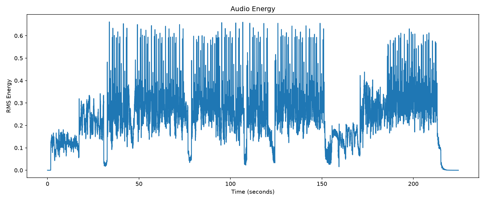
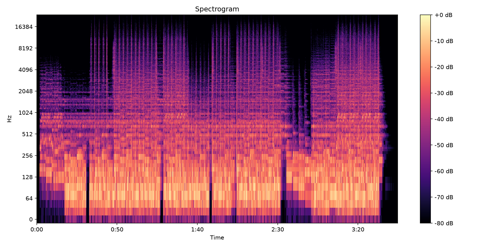

# Audio Analysis

Python-based audio analysis workflow developed as part of my exploration of audio engineering and creative technology.

The project analyzes an original music composition and extracts basic musical and audio characteristics, including:

- Audio duration
- Sample rate
- Estimated tempo (BPM)
- Beat positions
- RMS energy
- Spectral information

## Technologies

- Python
- Librosa
- NumPy
- Matplotlib
- SoundFile

## Example

The analysis was performed on an original music composition.

Results:

- Duration: 224.64 seconds
- Sample rate: 48 kHz
- Estimated tempo: 125 BPM
- Detected beats: 376

### Audio Energy

### Spectrogram

## Reproducibility

Create a virtual environment and install the required dependencies:

    python3 -m venv .venv
    source .venv/bin/activate
    pip install -r requirements.txt

Then run the analysis on an audio file:

    python analyze_audio.py "path/to/audio.wav"

The script generates:

- `audio_energy.png` — visualization of RMS energy over time
- `spectrogram.png` — frequency analysis over time
- `beats.txt` — detected beat positions in seconds

The source audio is not included in the repository.

## What This Demonstrates

This project explores practical applications of Python-based audio analysis within professional audio production workflows, including:

- Signal-level audio inspection
- Extraction of interpretable audio features
- Visualization of musical and spectral information
- Reproducible audio analysis workflows
- Integration of programming into creative audio processes

## Future Directions

Possible extensions include:

- Voice-focused audio analysis
- Automated audio quality control
- Feature extraction for machine-learning workflows
- Analysis tools for AI-assisted audio production
- Integration with generative audio workflows
